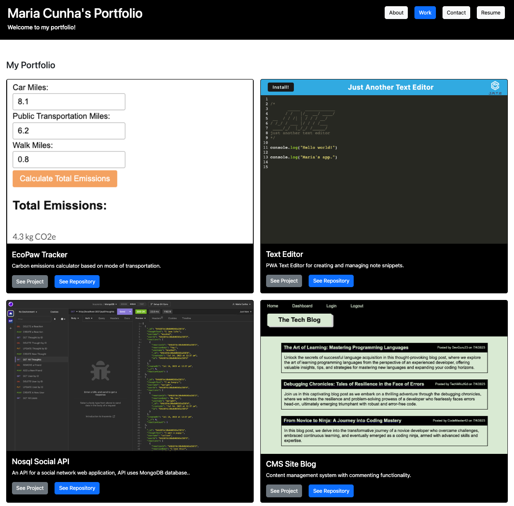

# Maria Cunha's Dev Portfolio

The displayed license badge is sourced from <a href="https://shields.io/category/license">Shields IO</a>.

## Description
This React-based portfolio showcases my skills and projects as a web developer using the latest technologies. Deployed on GitHub Pages, this portfolio provides potential employers and collaborators with a user-friendly and visually appealing way to explore my work.

You can view the React-based portfolio [here](https://mcunha17.github.io/mtc-portfolio/) and the GitHub repository [here](https://github.com/MCunha17/mtc-portfolio).

## Table of Contents
* [Features](#features)
* [Usage](#usage)
* [Technologies Used](#technologies-used)
* [Tests](#tests)
* [Contributing](#contributing)
* [License](#license)
* [Tests](#tests)
* [Resources](#resources)
* [Questions](#questions)

## Features
* Single-page application showcasing projects and skills.
* Navigation for seamless transition between different sections.
* Interactive project cards with links to deployed apps and GitHub repositories.
* Contact form with field validations for user-friendly interaction.
* Dynamic highlighting of the currently selected section in navigation.

## Usage
To view the React-based portfolio, visit https://mcunha17.github.io/mtc-portfolio/.

## Technologies Used
* React
* React DOM
* Bootstrap
* Vite

## Contributing
If you would like to contribute to this project, please fork the repository and submit a pull request with your proposed contributions.

## License
This project is licensed under: MIT License.

## Tests
Currently, there are no tests implemented for this project. If you would like to contribute, please follow the [contributing guidelines](#contributing).

## Resources
The following resources were referenced to create this application:
* React.dev: [Your First Component](https://react.dev/learn/your-first-component)
* React.dev: [State: A Component's Memory](https://react.dev/learn/state-a-components-memory)
* React.dev: [Passing Props to a Component](https://react.dev/learn/passing-props-to-a-component)
* React.dev: [input](https://react.dev/reference/react-dom/components/input)
* React.dev: [Conditional Rendering](https://react.dev/learn/conditional-rendering)

## Questions
If you have any questions, please visit my GitHub profile [MCunha17](https://github.com/MCunha17) or contact me at cunha.maria.theresa@gmail.com.